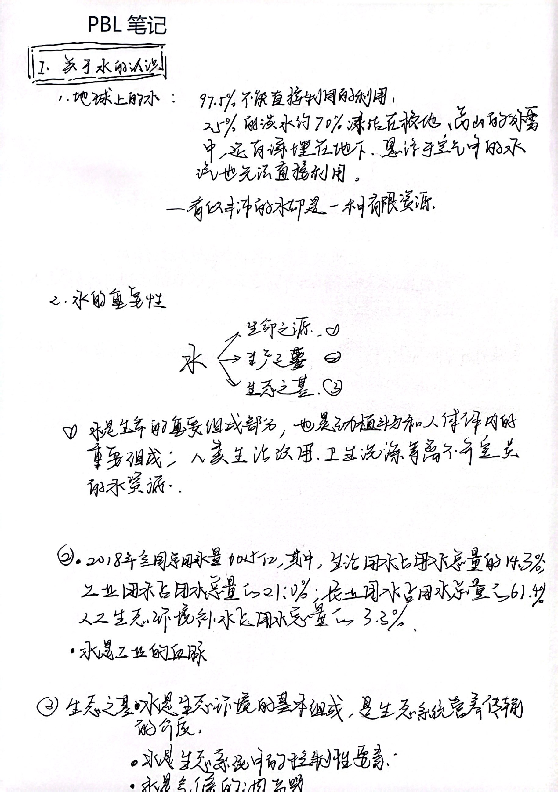
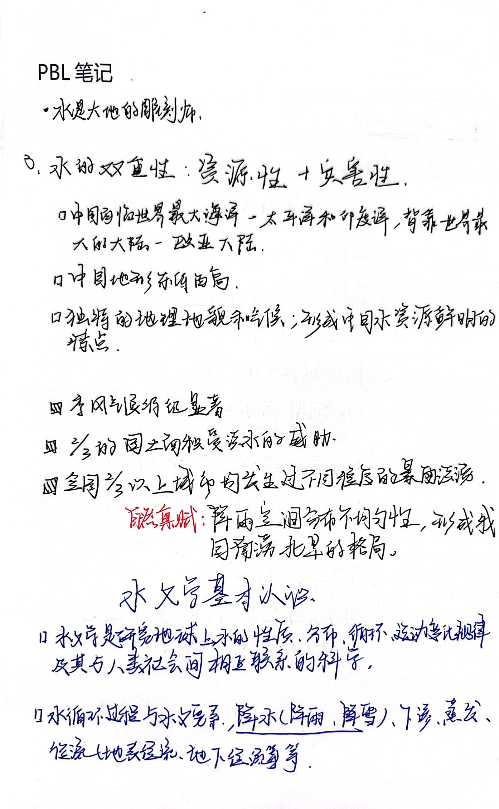
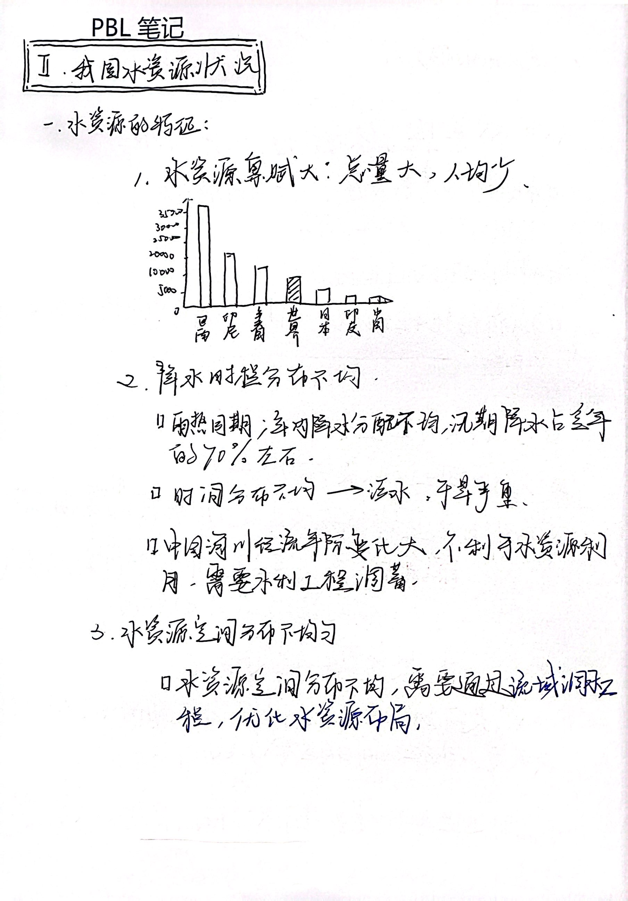
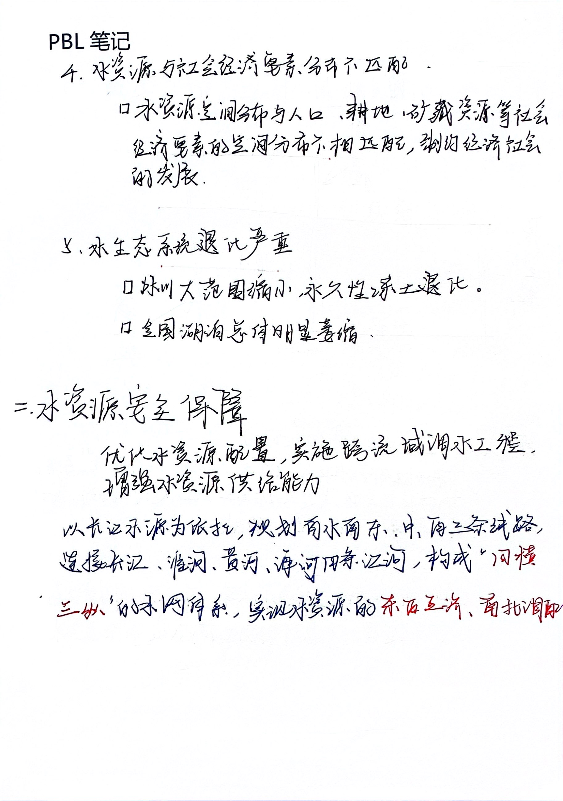
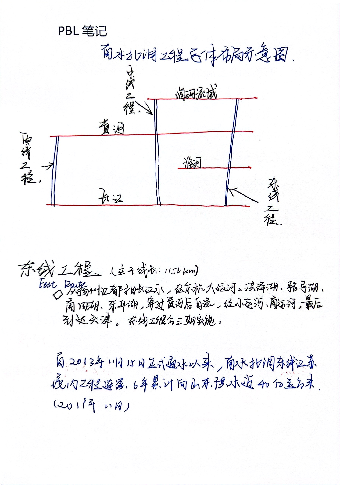
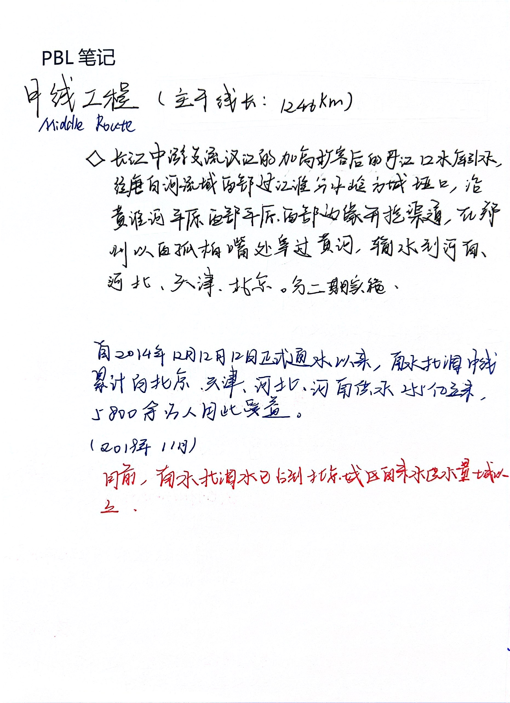
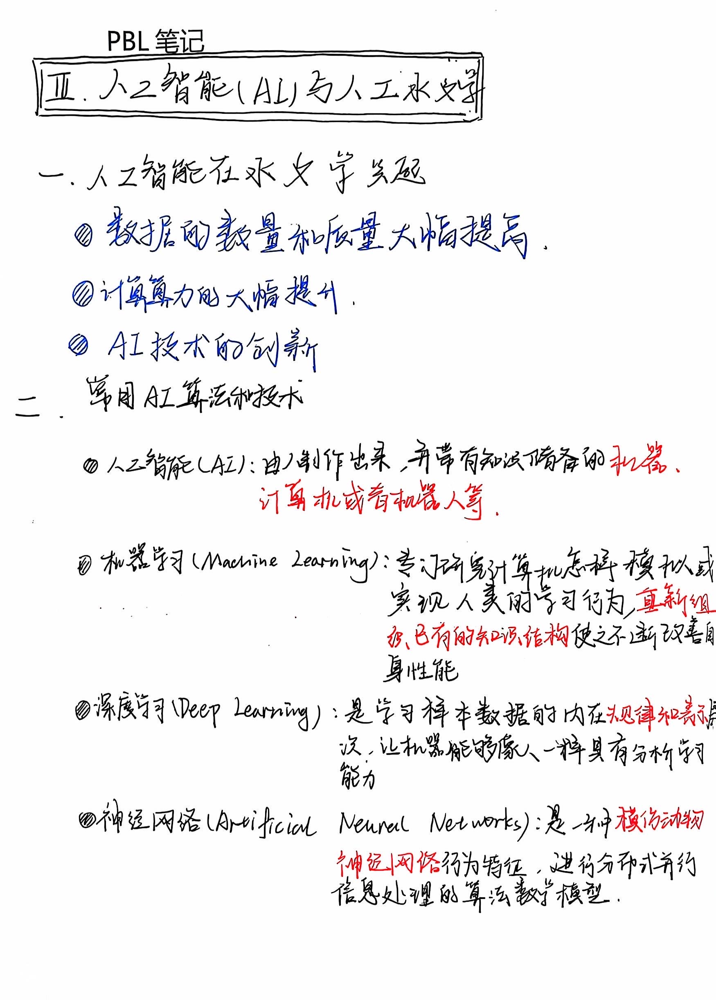
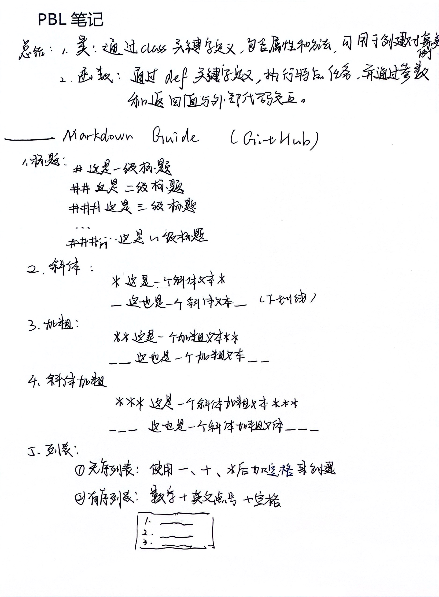

# **关于课题**

1. ***为什么要研究青藏高原？***

   青藏高原被誉为“亚洲水塔”，是全球气候变化的敏感区和生态环境的脆弱区，是中华民族的生态宝藏和环境屏障，也是我国重要的战略资源基地。作为世界上最大的高原，青藏高原的隆升显著改变了北半球的大气环流，导致了亚洲季风强化以及亚洲内陆干旱化，其陆-海-气相互作用对全球自然和气候环境产生深远影响。

2. ***为什么要进行径流预测？***

   青藏高原径流变化对国内外水资源供给有着深远影响。然而，气候变化、冰川融化、降水变化等因素使青藏高原的径流特征愈发复杂，预测难度日益增加，对径流演变规律的研究是区域水资源合理开发与有效利用的前提和基础。

3. ***为什么要采用AI的方法？***

   由于青藏高原地区海拔高、落差大、冰川、积雪广泛分布，使得实地考察数据缺失成为制约在青藏高原区域开展水文过程研究和深入理解由冰雪补给的流域水资源对气候变化响应机制的一个主要因素，因此针对此区域基于多源数据开展径流预测研究具有重要意义。AI可以通过神经网络的搭建帮助径流的预测，通过技术节省人力和时间。运用人工智能不但可以提高问题的求解精度，而且可以获得明显的经济效应。可以提高至少10倍工作效率。人工智能与水文学的结合具有很多好处，例如水位自动监测、河流洪水预报和河流水质预警预测。

## **学习笔记**

1. ***关于水的认识***

2. ***我国水资源状况***

3. ***人工智能AI与人工水文学***

4. ***Python Basic & Markdown Guide***

   

